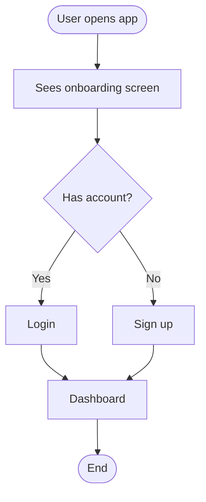
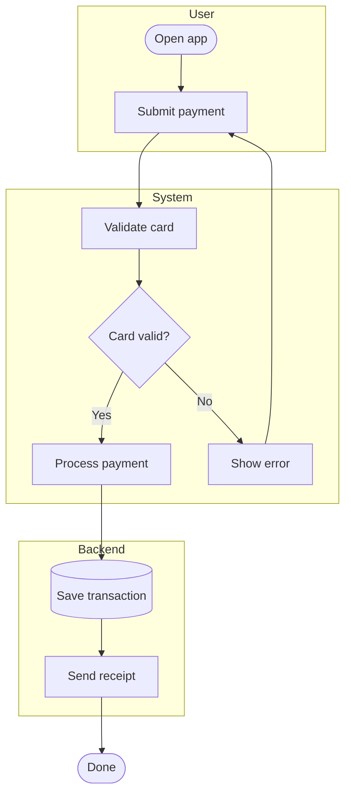
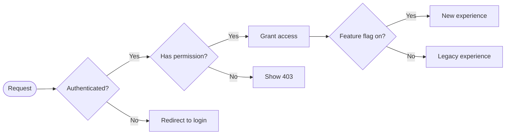
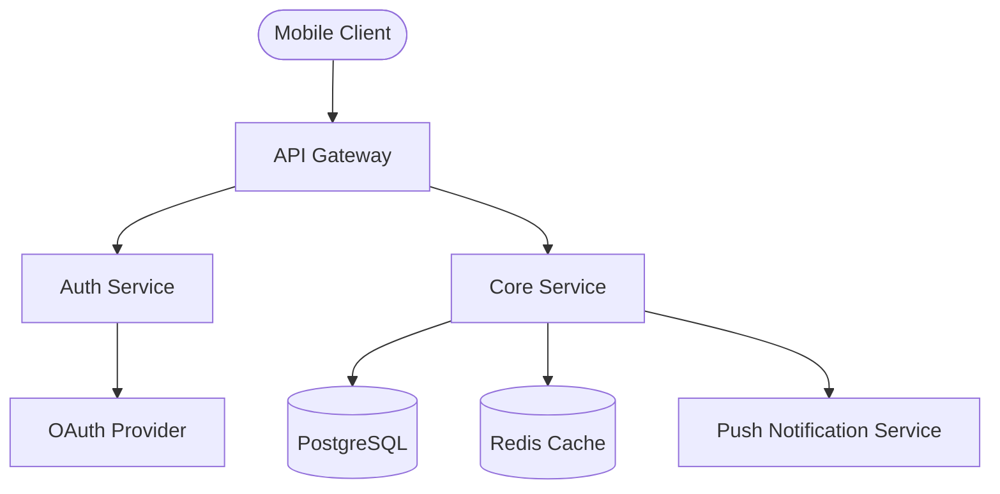
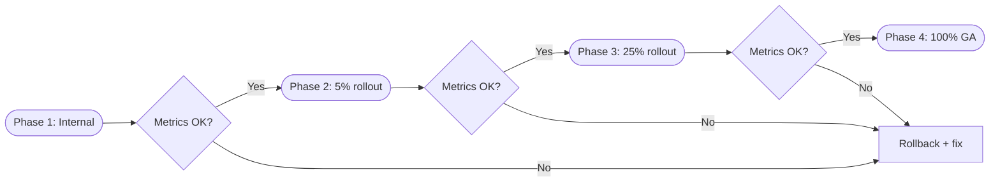

# PRD Flow Visualizer

Turns PRD content, feature descriptions, and user stories into visual flow diagrams in **FigJam (Figma)** or **Miro**.

---

## When to Apply

Use when the user wants to:
- Visualize a feature flow, user journey, or system architecture from a PRD
- Turn user stories or acceptance criteria into a flowchart
- Create a decision tree for feature logic or edge cases
- Map out a launch/rollout plan visually
- Draw any diagram related to product requirements
- Paste a feature description and wants it visualized (even without explicitly asking)

Also activate when:
- A PRD has just been generated via `prd-doc-pro` and the user says "visualize it" or "draw it"
- The user describes a multi-step feature in conversation and visual mapping would help

---

## Step-by-Step Process

### Step 0 — Pick the Right Chart Style

Before generating, consult the Figma flowchart reference to match the best chart type:

```
Reference: https://www.figma.com/resource-library/types-of-flow-charts/
```

Use this mapping for PRD content:

| PRD Context | Chart Type | Why |
|---|---|---|
| Single user story, linear happy path | **Process flow diagram** | Clear start-to-end steps |
| Feature with multiple actors (user + system + admin) | **Swimlane flowchart** | Shows handoffs between actors |
| Feature with branching logic, conditions, permissions | **Decision tree diagram** | Maps if/else paths clearly |
| Full onboarding or multi-screen journey | **Customer journey flowchart** | End-to-end experience |
| API integrations, services, data movement | **System / Data flow diagram** | Technical architecture view |
| Screen-to-screen navigation | **Website flowchart** | Page transitions |
| Launch/rollout plan with phases | **Workflow diagram** | Multi-step process with stages |
| Domain events and system reactions | **Event storming flowchart** | Commands, events, reactions |

Tell the user which type you picked and why (one sentence).

---

### Step 1 — Extract the Flow from PRD Content

Parse the source material and pull out:

- **Actors**: Who's involved (user personas, system, backend services, admin, external APIs)
- **Steps**: Sequential actions in order
- **Decisions**: Branching points (conditions, permissions, feature flags, A/B tests)
- **States**: Start state, end state, error states, edge cases
- **Swimlanes**: If multiple actors, group steps by actor

Sources to extract from (in order of preference):
1. User stories + acceptance criteria from the PRD
2. Feature description provided in conversation
3. Edge cases and error handling sections
4. Launch/rollout plan phases

If the description is vague or missing key branching logic, ask **one** clarifying question, then proceed.

---

### Step 2 — Determine Target Tool

**FigJam (default):**
- Use `Figma:generate_diagram` tool (Mermaid syntax)
- Default board: `https://www.figma.com/board/gcoyLPtnoyH7uSoeDxwr4O/Claude-flow`
  - `fileKey`: `gcoyLPtnoyH7uSoeDxwr4O`, `nodeId`: `0:1`
- Ask for a different board URL only if the user specifies one

**Miro:**
- Use `Miro:diagram_get_dsl` then `Miro:diagram_create`
- Requires board URL from user

Default to **FigJam** if not specified.

---

### Step 3 — Generate the Diagram

Build Mermaid syntax matching the selected chart type. Follow these patterns:

**User Story Flow (top-down):**


**Swimlane — Multi-Actor Feature:**


**Decision Tree — Feature Logic (left-to-right):**


**System Architecture:**


**Launch Rollout Plan:**


Call `Figma:generate_diagram` with:
- `mermaidSyntax`: the generated Mermaid code
- `name`: descriptive title (e.g. "Onboarding User Flow")
- `userIntent`: one sentence describing what the flow captures

---

### Step 4 — Confirm and Offer Refinement

After creating the diagram:

1. Confirm it was created and which chart style was used
2. Give a 2-3 sentence summary: actors, key steps, main decision points
3. Offer next steps:
   - "Want me to add error states or edge cases?"
   - "Should I add a separate diagram for the unhappy path?"
   - "Want me to break this into sub-flows for each user story?"

---

## PRD-Specific Flows

When working with a full PRD generated by `prd-doc-pro`, offer to visualize these:

| PRD Section | Suggested Diagram |
|---|---|
| User stories (all) | Customer journey covering the happy path |
| Single user story + AC | Process flow with decision nodes per AC |
| Edge cases | Decision tree with error branches |
| System dependencies | System/data flow diagram |
| Launch/rollout plan | Workflow diagram with phase gates |
| Multi-persona features | Swimlane per persona |

You can chain multiple diagrams for a full PRD — ask the user which sections to visualize.

---

## Edge Cases

- **Ambiguous feature**: Ask one clarifying question, then draw the happy path
- **Very complex PRD**: Offer to split into happy path + edge cases + error flows as separate diagrams
- **Multiple actors clearly present**: Default to swimlane
- **No Figma MCP connected**: Output the Mermaid syntax in a code block so the user can paste it manually
- **No board URL**: Use the default FigJam board
- **PRD not yet created**: Offer to generate the PRD first via `prd-doc-pro`, then visualize

---

## Quick Commands

| What you want | What to say |
|---|---|
| Visualize entire PRD flow | "visualize this PRD" / "/flow" |
| Single user story diagram | "draw a flow for [story name]" |
| System architecture | "diagram the architecture" |
| Launch plan visual | "visualize the rollout plan" |
| Edge case decision tree | "map out the edge cases" |
| Custom Figma board | "visualize this on [board URL]" |
| Miro instead of FigJam | "put this in Miro" + board URL |
